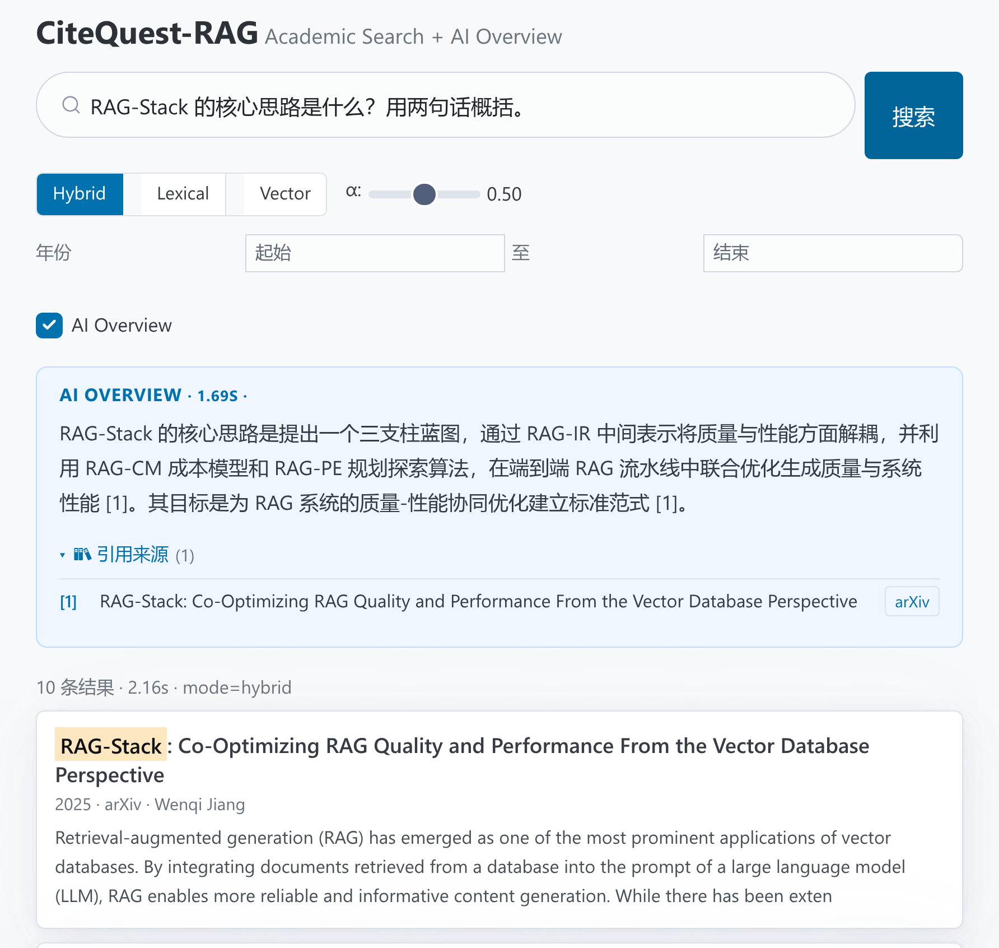
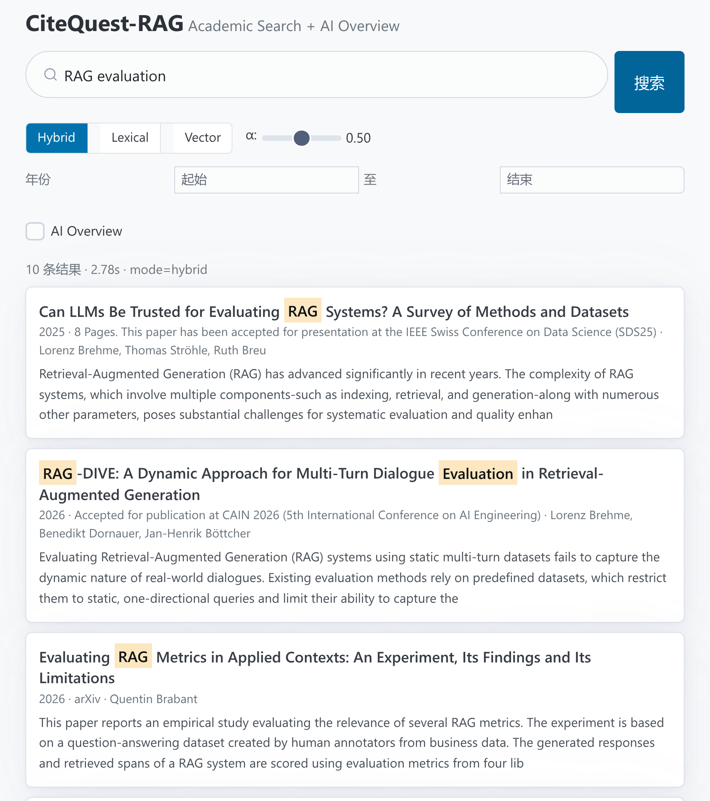
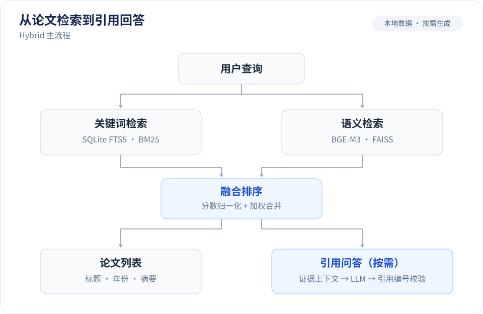

# CiteQuest

**学术论文检索与引用问答。**

输入关键词查找论文，或用自然语言提问，让系统结合检索到的论文摘要生成回答，并附上引用来源。支持中文查询、关键词与语义混合检索，以及发表年份筛选。

这是一个个人 AI 应用项目，覆盖数据处理、索引构建、检索、RAG、API、前端和评测。论文与索引存放在本地，生成回答通过 OpenAI 兼容接口调用模型。

[运行效果](#运行效果) · [工作流程](#工作流程) · [检索效果](#检索效果) · [本地运行](#本地运行)

## 运行效果

搜索结果先返回，AI Overview 随后显示回答和编号引用；展开来源可以查看论文标题并跳转到原文。



<details>
<summary>查看论文检索界面</summary>



</details>

以上截图来自本地 50,000 篇 arXiv CS 论文的索引，使用 Hybrid 检索与 DeepSeek 生成回答。截图展示应用交互，检索质量以[冻结测试集的评测报告](reports/retrieval_baseline_v1.md)为准。

## 工作流程



索引构建时，将论文标题与摘要整理为文本块，写入 SQLite FTS5，并用 BGE-M3 生成向量、构建 FAISS 索引。上图展示默认 Hybrid 模式；也可以单独使用关键词检索或语义检索。

- **混合检索**：BM25 与 Dense 分别召回候选，经过 min-max 分数归一化后加权融合。默认两路权重各为 `0.5`，可通过请求参数或环境变量调整。
- **中文查询**：为关键词分支补充英文检索词，向量分支保留原始问题。改写有 2 秒预算，失败时回退到原查询。
- **引用问答**：路由器判断是否需要生成回答；需要时复用检索结果，按预算组织摘要证据，交给 LLM，再检查回答中的 `[N]` 是否对应本轮来源。

前端通过 SSE 接收处理阶段和最终回答。索引构建支持批次检查点，长时间的向量生成任务可以在中断后恢复。

## 检索效果

在 **50,000 篇 arXiv CS 论文、100 条冻结测试查询**上，对比三种检索方式：

| 方法 | HitRate@10 | MRR@10 | nDCG@10 | 检索耗时 p50 |
| --- | ---: | ---: | ---: | ---: |
| BM25 | 90% | 0.8093 | 0.8315 | 162 ms |
| BGE-M3 Dense | 91% | 0.7951 | 0.8233 | 21 ms |
| **Hybrid** | **95%** | **0.8673** | **0.8881** | 203 ms |

Hybrid 的 HitRate@10 比最佳单路检索提高 **4 个百分点**。融合权重由另外 50 条 dev 查询选择，最终为 `0.5`；测试集不参与选参。表中耗时为原实验环境下的热查询检索耗时，不包含 LLM 生成。

查询由目标论文的标题和摘要生成，属于 **synthetic known-item 检索评测**：HitRate@10 衡量目标论文是否进入前十，不能代表问答准确率或任意真实问题的效果。完整协议、查询类型拆分和失败案例见 [Benchmark v1 报告](reports/retrieval_baseline_v1.md)。

后续已在 dev 集开展 RRF 融合对比、候选召回与融合损失归因，以及 FAISS 近似检索诊断；当前检索配置仍保留 min-max 融合。

## 本地运行

需要 Python 3.11+。首次运行需要下载 BGE-M3 模型并构建索引；语料、模型与索引均不随仓库分发。下面使用 1,000 篇论文准备一个较小的演示环境。

### 1. 安装依赖

```bash
git clone https://github.com/Akari6657/Ragsearch.git
cd Ragsearch

python3 -m venv .venv
source .venv/bin/activate
pip install -e ".[all]" arxiv python-dotenv
```

### 2. 准备数据和索引

```bash
python scripts/download_arxiv.py \
  --size 1000 --output data/raw/arxiv_cs_demo_1000.jsonl

python scripts/build_metadata_db.py \
  --input data/raw/arxiv_cs_demo_1000.jsonl \
  --db data/indexes/demo/metadata.sqlite

python scripts/build_fts.py --db data/indexes/demo/metadata.sqlite

python scripts/build_faiss.py \
  --db data/indexes/demo/metadata.sqlite \
  --output-dir data/indexes/demo/faiss --batch-size 8
```

### 3. 配置模型并启动

论文检索可以在没有 LLM API key 的情况下运行。需要真实问答时，复制配置模板，填写自己的接口地址、模型名和 key：

```bash
cp .env.example .env
# 编辑 .env 中的 LLM_BASE_URL、LLM_MODEL 和 LLM_API_KEY
```

未配置 key 时，问答使用 Mock Provider，中文关键词改写会跳过。

```bash
CITEQUEST_DB_PATH=data/indexes/demo/metadata.sqlite \
CITEQUEST_FAISS_DIR=data/indexes/demo/faiss \
uvicorn app.main:app --host 127.0.0.1 --port 8000
```

打开 <http://127.0.0.1:8000> 使用搜索页面，或访问 <http://127.0.0.1:8000/docs> 调试 API。

<details>
<summary>接口与配置速查</summary>

| 接口 | 用途 |
| --- | --- |
| `GET /health` | 检查索引是否就绪 |
| `POST /search` | 论文检索，可选 AI Overview |
| `POST /ask` | 引用问答 |
| `POST /ask/stream` | SSE 阶段反馈与最终回答 |

```bash
curl http://127.0.0.1:8000/search \
  -H 'Content-Type: application/json' \
  -d '{"query":"RAG evaluation","mode":"hybrid","top_k":5}'
```

`CITEQUEST_HYBRID_ALPHA` 设置默认关键词权重；请求中的 `alpha` 优先。`CITEQUEST_REWRITE_TIMEOUT_SECONDS` 设置中文查询改写的时间预算。

</details>

## 代码与验证

后端使用 **FastAPI / Pydantic**，检索使用 **SQLite FTS5 / BGE-M3 / FAISS**，前端使用 **HTML / CSS / Alpine.js**。

```text
app/
  ingestion/   论文归一化与文本块处理
  retrieval/   关键词、向量与混合检索
  rag/         查询路由、改写、上下文、生成与引用校验
  api/         检索与问答接口
  eval/        检索评测、诊断与 smoke 验证
  core/        数据模型与配置
scripts/       数据下载与索引构建
frontend/      搜索界面
tests/         自动化测试
reports/       正式评测报告
```

```bash
pytest tests/ -v
```

目前有 **273 项测试**，覆盖数据处理、检索、索引恢复、引用校验、API 和评测逻辑。RAG 单元测试使用 Mock Provider。

## 当前边界

- 当前 arXiv 演示与正式评测使用标题和摘要，回答的证据范围限于这些文本。
- 引用检查验证编号与来源的对应关系，尚未实现逐条论断的语义支持校验。
- RAG 回答质量仍需要更系统的人工评测；论文对比与自主研究 Agent 尚未实现。
