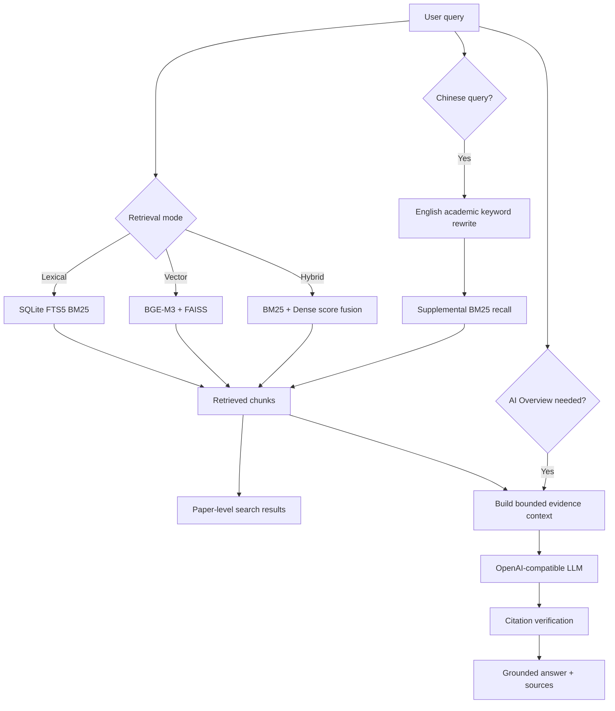

# CiteQuest-RAG

**Local-first hybrid academic search with citation-grounded answers.**

CiteQuest-RAG is an end-to-end AI application for searching scientific papers
and answering research questions with traceable evidence. It combines lexical
retrieval, dense retrieval, score-fusion hybrid search, query understanding,
and citation-aware RAG behind a FastAPI service and a lightweight search UI.

The project is intentionally more than an LLM wrapper: papers are ingested and
indexed locally, every generated answer is tied to retrieved chunks, and the
retrieval stack is evaluated independently from the LLM.

> **Status:** the product pipeline and reproducible Benchmark v1 harness are
> implemented. The official 50,000-paper baseline is in progress; no retrieval
> quality result is claimed before the frozen test run is complete.

## Highlights

| Capability | Implementation |
|---|---|
| Hybrid academic search | SQLite FTS5 BM25, BGE-M3 embeddings, FAISS IVF, and weighted score fusion |
| Citation-grounded RAG | Evidence budgeting, numbered citations, citation metadata, and validity checks |
| Query understanding | Rule-first RAG routing with an LLM fallback for ambiguous requests |
| Chinese query support | Chinese queries can be rewritten into English academic keywords for supplemental BM25 recall |
| Reproducible indexing | Local SQLite and FAISS artifacts with resumable, disk-backed embedding builds |
| Evaluation-first workflow | Frozen dev/test protocol, paper-level metrics, latency reporting, and deterministic error groups |
| Runnable application | FastAPI endpoints, SSE progress streaming, health checks, and a browser search interface |
| Automated verification | 164 unit, integration, and end-to-end smoke tests |

## How It Works



The selected retriever always receives the original query. Chinese rewriting
is a supplemental lexical recall branch, not a replacement for Dense or Hybrid
retrieval. The official retrieval benchmark bypasses rewriting, routing, and
RAG so every baseline receives the same frozen query.

## Retrieval Stack

### BM25

- SQLite FTS5 provides a compact, local lexical index.
- Multi-term queries use explicit OR semantics for broad academic recall.
- Quoted phrases are detected and receive a post-retrieval phrase boost.
- Candidate over-fetching allows phrase-boosted results to be reranked before
  the final `top_k` is returned.

### Dense Retrieval

- `BAAI/bge-m3` encodes queries and title/abstract chunks into 1024-dimensional
  normalized vectors.
- FAISS IVF performs local approximate nearest-neighbor search with cosine
  similarity implemented as inner product.
- Index construction writes durable batch checkpoints, so long embedding jobs
  can resume after interruption.

### Hybrid Retrieval

BM25 and Dense candidates are min-max normalized with the correct score
direction, merged by chunk ID, and ranked with:

```text
hybrid_score = alpha * lexical_score + (1 - alpha) * dense_score
```

The default `alpha` is `0.5`. Benchmark v1 selects a tuned value on the dev
split only, then freezes it before test evaluation.

## Grounded RAG

Search results and generated answers remain inspectable as separate outputs.
When an AI Overview is requested:

1. A rule-first router decides whether the query benefits from synthesis.
2. Pre-retrieved chunks are reused instead of silently running a second search.
3. The context builder assigns stable citation IDs within a token budget.
4. An OpenAI-compatible LLM answers only from the supplied evidence.
5. Citation markers such as `[1]` are checked against the evidence set and
   returned with source metadata.

Unit tests use a mock provider, so the test suite never depends on a paid API.

## Retrieval Benchmark v1

The current project priority is a controlled baseline before adding rerankers,
HyDE, multi-hop retrieval, MCP integrations, or Agent workflows.

| Item | Protocol |
|---|---|
| Corpus | Exactly 50,000 category-balanced arXiv computer-science papers |
| Search text | One title + abstract chunk per paper |
| Query set | 150 generated and frozen queries: keyword, natural question, and semantic paraphrase |
| Split | 50 dev queries for Hybrid alpha selection; 100 untouched test queries |
| Systems | BM25, BGE-M3 Dense, Hybrid 0.5, and dev-tuned Hybrid |
| Metrics | HitRate@5/10, Recall@5/10, MRR@10, nDCG@10, mean/p50/p95 warm latency |
| Ranking unit | Chunks are retrieved, then deduplicated to papers while preserving rank |

Official-run gates verify corpus size, query distribution, SQLite/FTS/FAISS
counts, ID-map order, embedding dimension, artifact hashes, and the recorded Git
revision. The test split is never used to select retrieval parameters.

This is a synthetic known-item benchmark: each query is generated from one
target paper's title and abstract. It supports controlled retriever comparison,
but it is not presented as a substitute for human relevance judgments or a
public IR benchmark.

### Current Progress

- Core ingestion, BM25, Dense, Hybrid, RAG, API, and UI paths: complete.
- Resumable 10k BGE-M3 demo index and operational smoke tests: complete locally.
- 50k arXiv CS corpus and SQLite/FTS index: complete locally.
- Query generator, leakage checks, metrics, report builder, and reproducibility
  gates: complete.
- Frozen 150-query set, 50k FAISS index, and official baseline report: in
  progress.

## API Surface

| Endpoint | Method | Purpose |
|---|---|---|
| `/` | GET | Browser search interface |
| `/health` | GET | Index availability and runtime capability status |
| `/search` | POST | Lexical, Dense, or Hybrid paper search with optional AI Overview |
| `/ask` | POST | Citation-grounded question answering |
| `/ask/stream` | POST | SSE progress events and final grounded answer |
| `/docs` | GET | Interactive OpenAPI documentation |

Example search request:

```json
{
  "query": "retrieval augmented generation evaluation",
  "top_k": 10,
  "mode": "hybrid",
  "alpha": 0.5,
  "include_overview": true
}
```

## Quickstart

Python 3.11 or newer is required. Corpora and generated indexes are local build
artifacts and are intentionally not included in the repository.

```bash
git clone https://github.com/Akari6657/Ragsearch.git
cd Ragsearch

python3 -m venv .venv
source .venv/bin/activate
pip install -e ".[all]" arxiv python-dotenv

# Download a small arXiv CS corpus.
python scripts/download_arxiv.py \
  --size 1000 \
  --output data/raw/arxiv_cs_demo_1000.jsonl

# Build SQLite metadata, FTS5, and FAISS indexes.
python scripts/build_metadata_db.py \
  --input data/raw/arxiv_cs_demo_1000.jsonl \
  --db data/indexes/demo/metadata.sqlite \
  --overwrite
python scripts/build_fts.py --db data/indexes/demo/metadata.sqlite
python scripts/build_faiss.py \
  --db data/indexes/demo/metadata.sqlite \
  --output-dir data/indexes/demo/faiss \
  --batch-size 8

# Point the API at the demo artifacts.
CITEQUEST_DB_PATH=data/indexes/demo/metadata.sqlite \
CITEQUEST_FAISS_DIR=data/indexes/demo/faiss \
uvicorn app.main:app --reload --host 127.0.0.1 --port 8000
```

Open `http://127.0.0.1:8000`. Search works without an LLM key. For real RAG
generation, copy `.env.example` to `.env` and configure an OpenAI-compatible
endpoint, model, and API key.

## Tech Stack

| Layer | Technology |
|---|---|
| API and schemas | FastAPI, Pydantic v2, Uvicorn |
| Lexical retrieval | SQLite FTS5, BM25 |
| Dense retrieval | Sentence Transformers, BGE-M3, FAISS IVF |
| RAG | OpenAI-compatible chat completion API, bounded evidence context |
| Storage | SQLite, JSONL, local FAISS files |
| Frontend | Framework-free HTML, CSS, and JavaScript |
| Testing | Pytest, FastAPI test clients, HTTP and retrieval smoke suites |

## Repository Layout

```text
app/
  ingestion/     normalization and chunk construction
  retrieval/     BM25, Dense, and Hybrid search
  rag/           routing, rewriting, context, generation, citations
  api/           search and question-answering routes
  eval/          retrieval metrics and operational smoke evaluation
  core/          schemas and runtime configuration
scripts/         corpus download, index builds, and benchmark construction
frontend/        browser search experience
tests/           unit, integration, and end-to-end smoke tests
```

## Verification

```bash
pytest tests/ -v
```

The suite covers ingestion, lexical query semantics, vector search, Hybrid
score direction, resumable FAISS builds, citation validation, API readiness,
query-set construction, benchmark metrics, artifact gates, and HTTP smoke
behavior.

## Next Milestone

1. Freeze and review the 150-query evaluation set.
2. Build the official 50k BGE-M3 FAISS index.
3. Run BM25, Dense, Hybrid 0.5, and dev-tuned Hybrid on the untouched test set.
4. Publish aggregate metrics, query-type breakdowns, latency, and representative
   failure cases.
5. Choose the next optimization from measured errors rather than adding features
   speculatively.

## License

MIT
