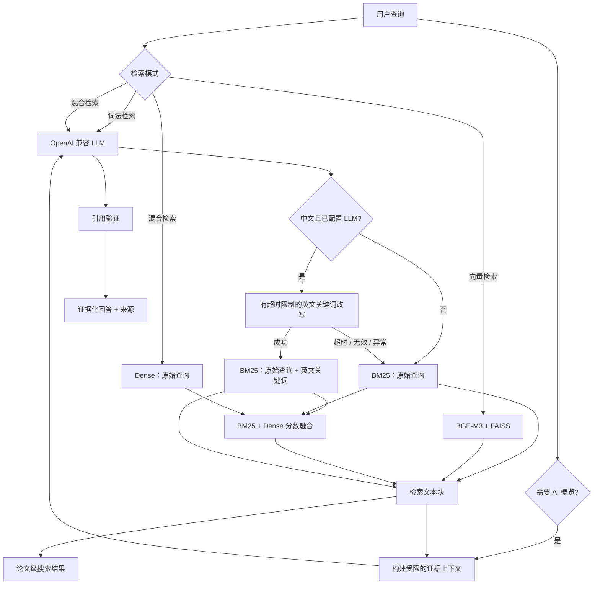

# CiteQuest-RAG

[English](README.md) | **简体中文**

**本地优先的混合学术检索与引用可追溯问答系统。**

CiteQuest-RAG 是一个端到端 AI 应用，用于检索科研论文并基于可追溯证据回答研究问题。项目将词法检索、向量检索、分数融合的混合检索、查询理解和引用感知 RAG 集成在 FastAPI 服务与轻量级搜索界面中。

这个项目并非简单封装 LLM：论文数据在本地完成摄取和索引，生成答案必须关联到实际检索到的文本块，检索系统也可以脱离 LLM 独立评测。

> **当前状态：** 端到端产品链路和正式 Retrieval Benchmark v1 均已完成。在包含 50,000 篇论文、100 条冻结测试查询的评测中，Hybrid 检索取得了 95% HitRate@10 和 0.8881 nDCG@10。

## 项目亮点

| 能力 | 实现方式 |
|---|---|
| 混合学术检索 | SQLite FTS5 BM25、BGE-M3 向量、FAISS IVF 与加权分数融合 |
| 引用可追溯 RAG | 证据预算、编号引用、引用元数据与有效性检查 |
| 查询理解 | 规则优先的 RAG 路由，并使用 LLM 处理模糊请求 |
| 中文查询支持 | 有界、失败可降级的英文关键词扩展，并正式参与 BM25 与 Hybrid 排名 |
| 可复现索引构建 | 本地 SQLite 与 FAISS 产物，支持可恢复的磁盘检查点式向量构建 |
| 评测优先 | 冻结的 dev/test 协议、论文级指标、延迟统计与确定性错误分组 |
| 可运行应用 | FastAPI 接口、SSE 进度流、健康检查与浏览器搜索界面 |
| 自动化验证 | 223 项单元测试、集成测试与端到端 smoke 测试 |

## 快速开始

需要 Python 3.11 或更高版本。语料和生成的索引均为本地构建产物，不包含在 Git 仓库中。

```bash
git clone https://github.com/Akari6657/Ragsearch.git
cd Ragsearch

python3 -m venv .venv
source .venv/bin/activate
pip install -e ".[all]" arxiv python-dotenv

# 下载一份小规模 arXiv CS 语料。
python scripts/download_arxiv.py \
  --size 1000 \
  --output data/raw/arxiv_cs_demo_1000.jsonl

# 构建 SQLite metadata、FTS5 和 FAISS 索引。
python scripts/build_metadata_db.py \
  --input data/raw/arxiv_cs_demo_1000.jsonl \
  --db data/indexes/demo/metadata.sqlite \
  --overwrite
python scripts/build_fts.py --db data/indexes/demo/metadata.sqlite
python scripts/build_faiss.py \
  --db data/indexes/demo/metadata.sqlite \
  --output-dir data/indexes/demo/faiss \
  --batch-size 8

# 让 API 使用演示索引。
CITEQUEST_DB_PATH=data/indexes/demo/metadata.sqlite \
CITEQUEST_FAISS_DIR=data/indexes/demo/faiss \
uvicorn app.main:app --reload --host 127.0.0.1 --port 8000
```

打开 `http://127.0.0.1:8000`。搜索功能无需 LLM API key 即可运行。如需真实 RAG 生成，请将 `.env.example` 复制为 `.env`，并配置 OpenAI 兼容 endpoint、模型与 API key。

## 工作流程



对于中文 Lexical 和 Hybrid 请求，系统会将有效的英文改写与原查询组合，再统一执行一次 BM25 排名；Dense 始终接收原始查询。未配置真实 API key 时会立即跳过改写，发生超时、接口异常或输出无效时则使用完全不变的原查询。默认改写预算为 2 秒，可通过 `CITEQUEST_REWRITE_TIMEOUT_SECONDS` 配置。纯 Vector 模式不会调用改写。正式 Retrieval Benchmark 会绕过查询改写、路由和 RAG，确保每个 baseline 接收完全相同的冻结查询。

## 检索系统

### BM25

- 使用 SQLite FTS5 构建紧凑的本地词法索引。
- 多词查询采用显式 OR 语义，提高学术检索的广泛召回能力。
- 检测带引号的短语，并在检索后进行短语加权。
- 通过候选过采样，在返回最终 `top_k` 前对短语命中结果重新排序。

### Dense Retrieval

- 使用 `BAAI/bge-m3` 将查询和标题/摘要文本块编码为 1024 维归一化向量。
- 使用 FAISS IVF 在本地执行近似最近邻检索，并通过内积实现余弦相似度。
- 索引构建过程会写入持久化批次检查点，长时间的向量生成任务可在中断后恢复。

### Hybrid Retrieval

BM25 与 Dense 候选会按照正确的分数方向进行 min-max 归一化，随后按文本块 ID 合并，并使用以下公式排序：

```text
hybrid_score = alpha * lexical_score + (1 - alpha) * dense_score
```

生产环境默认 `alpha` 为 `0.5`，可通过 `CITEQUEST_HYBRID_ALPHA` 配置；API 请求中显式提供的值优先，响应会返回最终采用的 `effective_alpha`。Benchmark v1 始终使用显式冻结值，不受生产环境配置影响。

对于完成中文扩展的 Hybrid 查询，BM25 分支接收“原始文本 + 已验证英文关键词”，Dense 分支仍接收原始文本，随后两路候选继续使用普通 Hybrid 检索相同的归一化与融合流程。

## 引用可追溯 RAG

搜索结果和生成答案作为独立输出保留，便于检查。当请求 AI Overview 时：

1. 规则优先的路由器判断该查询是否需要综合回答。
2. 直接复用已经检索到的文本块，避免静默执行第二次检索。
3. 上下文构建器在 token 预算内分配稳定的引用编号。
4. OpenAI 兼容 LLM 只能基于给定证据回答。
5. 系统检查 `[1]` 等引用标记是否存在于证据集合中，并返回对应来源元数据。

单元测试使用 Mock Provider，因此测试套件不依赖付费 API。

## Retrieval Benchmark v1

Benchmark v1 在引入 reranker、HyDE、多跳检索、MCP 或 Agent 工作流之前，先建立一套可控的检索 baseline。

| 项目 | 评测协议 |
|---|---|
| 语料库 | 50,000 篇按类别均衡采样的 arXiv 计算机科学论文 |
| 检索文本 | 每篇论文一个标题 + 摘要文本块 |
| 查询集 | 150 条生成后冻结的查询，包含关键词、自然语言问题和语义改写 |
| 数据划分 | 50 条 dev 查询用于选择 Hybrid alpha，100 条 test 查询保持隔离 |
| 对比系统 | BM25、BGE-M3 Dense、Hybrid 0.5 与 dev-tuned Hybrid |
| 评测指标 | HitRate@5/10、Recall@5/10、MRR@10、nDCG@10、平均/p50/p95 热查询延迟 |
| 排名单位 | 先检索文本块，再保留原始顺序并去重为论文级排名 |

正式运行门槛会验证语料规模、查询分布、SQLite/FTS/FAISS 数量、ID map 顺序、向量维度、产物哈希与 Git revision。测试集从不用于选择检索参数。

### 实测结果

| 方法 | HitRate@5 | HitRate@10 | MRR@10 | nDCG@10 | p50 延迟 |
|---|---:|---:|---:|---:|---:|
| BM25 | 0.8700 | 0.9000 | 0.8093 | 0.8315 | 162.003 ms |
| BGE-M3 Dense | 0.8900 | 0.9100 | 0.7951 | 0.8233 | 21.237 ms |
| Hybrid 0.5 | **0.9400** | **0.9500** | **0.8673** | **0.8881** | 203.049 ms |

dev sweep 最终选择 `alpha = 0.50`，因此 tuned Hybrid 与预设的 0.5 baseline 结果相同。Hybrid 的 HitRate@10 比最佳单路检索提高了 4 个百分点。当前最明显的弱项是语义改写查询，其 HitRate@10 为 0.8529，而关键词查询和自然语言问题均为 1.0000。

构建本地 50k 数据与索引后，可使用以下命令复现实验：

```bash
python -m app.eval.retrieval_eval \
  --eval data/eval/retrieval_v1.jsonl \
  --db data/indexes/benchmark_v1/metadata.sqlite \
  --index-dir data/indexes/benchmark_v1/faiss \
  --raw data/raw/arxiv_cs_benchmark_v1_50000.jsonl \
  --manifest reports/benchmark_v1_manifest.json \
  --output-json reports/retrieval_baseline_v1.json \
  --output-md reports/retrieval_baseline_v1.md
```

完整的 dev alpha sweep、查询类型拆分结果、延迟和确定性错误分组请参阅 [Benchmark v1 完整报告](reports/retrieval_baseline_v1.md)。

该评测属于 synthetic known-item benchmark：每条查询由一篇目标论文的标题和摘要生成。它适合用于受控的检索器对比，但不能替代人工相关性标注或标准公共 IR benchmark。

### 当前进度

- 数据摄取、BM25、Dense、Hybrid、RAG、API 与 UI：已完成。
- 可恢复的 10k BGE-M3 演示索引与运行 smoke 测试：已在本地完成。
- 50k arXiv CS 语料和 SQLite/FTS 索引：已在本地完成。
- 查询生成器、泄漏检查、评测指标、报告生成器与可复现门槛：已完成。
- 150 条冻结查询与冻结前质量审查：已在本地完成。
- 50k BGE-M3 FAISS 索引与正式 baseline 报告：已在本地完成。
- 基于 baseline 的检索优化：尚未开始。

## API 接口

| Endpoint | 方法 | 用途 |
|---|---|---|
| `/` | GET | 浏览器搜索界面 |
| `/health` | GET | 索引可用性与运行能力状态 |
| `/search` | POST | BM25、Dense 或 Hybrid 论文检索，可选 AI Overview |
| `/ask` | POST | 引用可追溯的研究问答 |
| `/ask/stream` | POST | SSE 进度事件与最终证据化回答 |
| `/docs` | GET | 交互式 OpenAPI 文档 |

搜索请求示例：

```json
{
  "query": "retrieval augmented generation evaluation",
  "top_k": 10,
  "mode": "hybrid",
  "alpha": 0.5,
  "include_overview": true
}
```

## 技术栈

| 层级 | 技术 |
|---|---|
| API 与数据模型 | FastAPI、Pydantic v2、Uvicorn |
| 词法检索 | SQLite FTS5、BM25 |
| 向量检索 | Sentence Transformers、BGE-M3、FAISS IVF |
| RAG | OpenAI 兼容 Chat Completion API、受限证据上下文 |
| 存储 | SQLite、JSONL、本地 FAISS 文件 |
| 前端 | 原生 HTML、CSS 与 JavaScript |
| 测试 | Pytest、FastAPI TestClient、HTTP 与检索 smoke 测试 |

## 仓库结构

```text
app/
  ingestion/     数据归一化与文本块构建
  retrieval/     BM25、Dense 与 Hybrid 检索
  rag/           路由、改写、上下文、生成与引用
  api/           搜索与问答接口
  eval/          检索指标与运行 smoke 评测
  core/          共享 schema 与运行配置
scripts/         语料下载、索引构建与 benchmark 构建
frontend/        浏览器搜索界面
tests/           单元测试、集成测试与端到端 smoke 测试
```

## 验证

```bash
pytest tests/ -v
```

测试覆盖数据摄取、词法查询语义、向量检索、Hybrid 分数方向、可恢复 FAISS 构建、引用校验、API readiness、查询集构建、benchmark 指标、产物门槛和 HTTP smoke 行为。

## 下一阶段

1. 在 dev split 上通过候选 Recall@50 和 FAISS `nprobe` sweep 诊断语义改写查询失败。
2. 在选择优化方案前，判断剩余失败来自候选生成还是分数融合。
3. 只有在相关论文已进入候选池时，才评测 reranking 或替代融合方法。
4. 在声明 optimized v2 结果前冻结一份新的 holdout，避免使用已经观察过的 Benchmark v1 test 进行模型选择。
